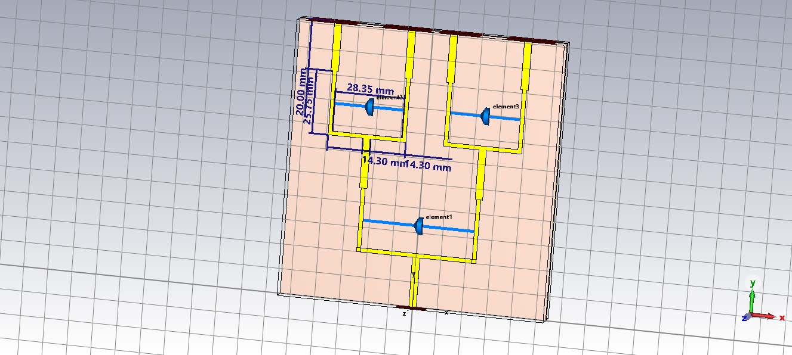
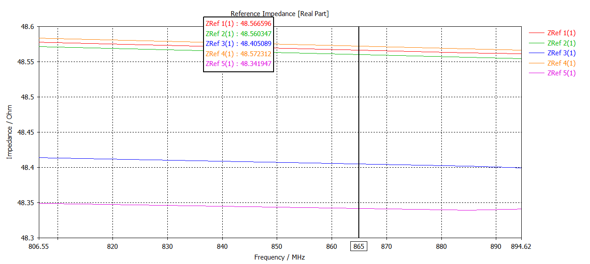

# RF Power Combiner

### CST Studio Suite | RF & Microwave Engineering | Microwave Network Design

---

## Overview

This project presents the design and electromagnetic simulation of an RF power combiner using **CST Studio Suite**.

The project focuses on the development of the microwave combining structure and the evaluation of its electromagnetic and RF characteristics through CST simulation.

The repository contains the CST model, design geometry, impedance analysis, S-parameter results, and design parameters.

---

## Objectives

- Design an RF power combiner using a microwave transmission-line structure.
- Develop the complete electromagnetic model in CST Studio Suite.
- Analyze the impedance characteristics of the structure.
- Evaluate the simulated S-parameter response.
- Study the RF behavior of the combining network.
- Provide a simulation platform for further optimization and integration with RF systems.

---

## Design Concept

A power combiner is a passive RF network used to combine signals from multiple input ports into a common output.

The basic operating concept can be represented as:

**RF Input 1 + RF Input 2 + ... → Combining Network → RF Output**

The transmission-line geometry is designed to provide appropriate impedance transformation and power transfer between the input and output ports.

---

## Design Methodology

**RF Architecture → Transmission-Line Design → Impedance Matching → CST Model → EM Simulation → S-Parameter Analysis**

---

## Simulation Tool

The complete electromagnetic structure was developed and simulated using:

- **CST Studio Suite**
- 3D electromagnetic simulation
- S-parameter analysis
- Impedance analysis
- Microwave network analysis

---

## Design Model

The simulated power-combiner structure was developed in CST Studio Suite.

### Power Combiner Design



---

## Impedance Analysis

The impedance characteristics of the designed structure were analyzed using CST simulation.



---

## S-Parameter Results

The simulated S-parameter response is used to evaluate the RF performance of the power-combining network.


---

## Project Parameters

The design parameters used in the CST model are provided separately in:

```text
parameters/parameters.txt
